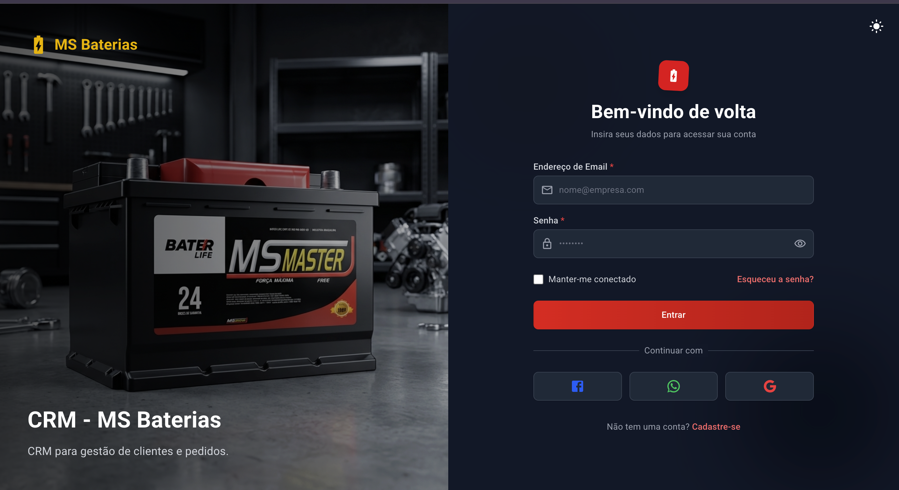
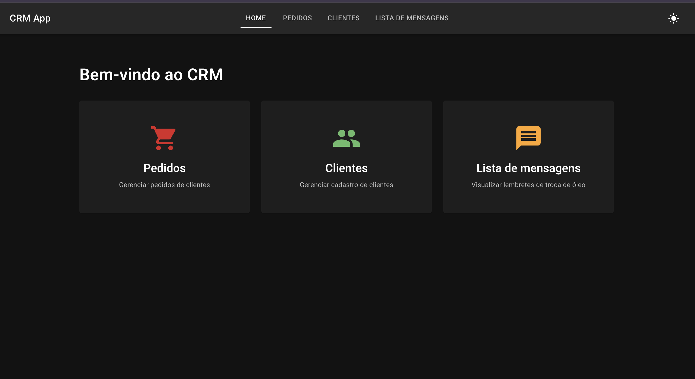
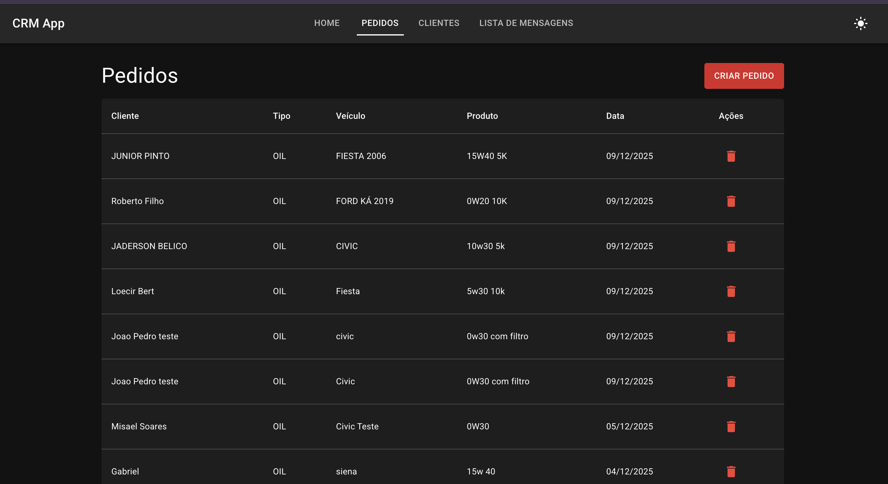
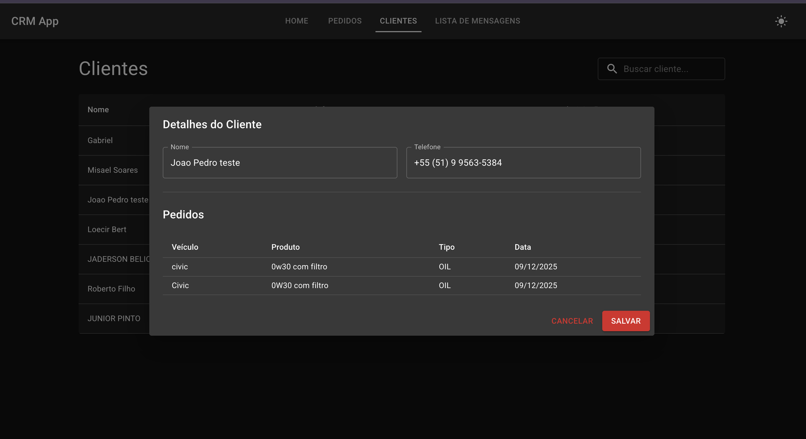
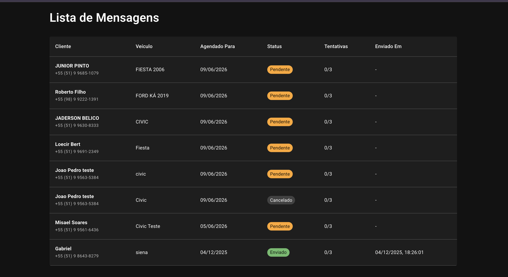

# CRM Web

Simple CRM for customer and order management, featuring automated message sending.

  
    
  
  
   
  
  

## Features

- **Customer Management**: Centralized hub for viewing customers.
- **Order Management**: Track and manage orders efficiently.
- **Automated Messaging**: System for sending automated messages to customers.
- **Feedback System**: Global snackbar notifications for API responses (success/error).

## Technical Stack

- **Framework**: React 19 + TypeScript
- **Build Tool**: Vite
- **Styling**:
  - Material UI (MUI) v7
  - Tailwind CSS v4
  - Emotion
- **Routing**: React Router DOM v7
- **HTTP Client**: Axios
- **Utilities**: Lodash Debounce

## Available Scripts

### Development

- `npm run dev`: Starts the development server.
- `npm run preview`: Previews the production build locally.

### Code Quality

- `npm run lint`: Runs ESLint to check for code issues.
- `npm run format`: Formats code using Prettier.
- `npm run pr-check`: Runs a full check (format, lint, and build) before opening a PR.

### Build

- `npm run build`: Compiles the application for production.

## Message Handling (Global Snackbar)

The frontend features a **Global Snackbar** system to display success and error messages returned by the API.

- **Responsibility**: The API is the source of truth for messages. The frontend only displays them.
- **How it works**:
  - The `axios-client` intercepts all responses.
  - If the response contains a message (either success or error), it is dispatched to the `SnackbarContext`.
  - The Snackbar automatically displays the message (Green for success, Red for error).
  - If the API does not return a specific message, a generic message is displayed.
